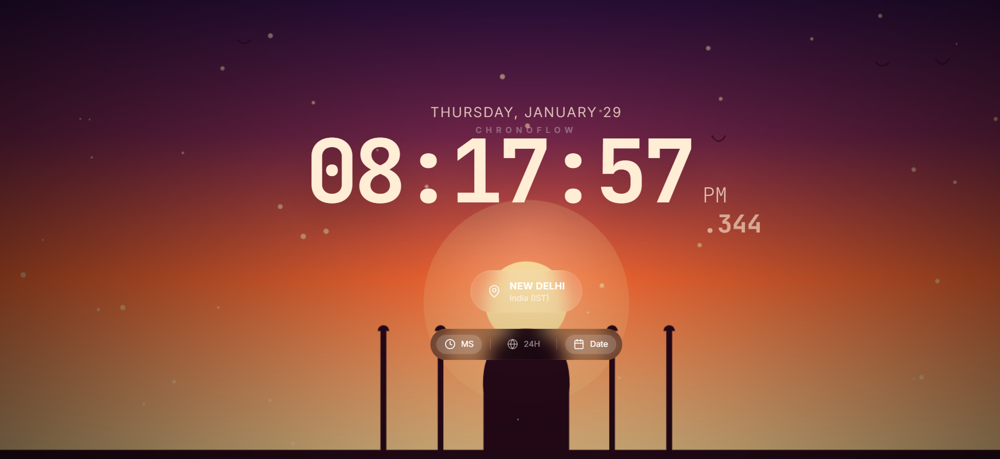

# ChronoFlow – Interactive World Clock

## Application Interface




ChronoFlow is an interactive world clock web application that displays real-time time across multiple global timezones with dynamically rendered, location-based animated backgrounds. The application integrates accurate timezone handling with canvas-driven visual effects to deliver an immersive global time experience.

---

## Overview

ChronoFlow demonstrates the practical use of timezone-aware logic combined with modular frontend architecture and real-time rendering. Each city is mapped to a unique visual theme, enabling users to visually and temporally experience different regions of the world.

---

## Features

- Real-time world clock with accurate timezone support  
- Multiple city selection with instant updates  
- Location-based animated backgrounds  
- Interactive and responsive user interface  
- Modular React component architecture  
- Canvas-based animation rendering  

---

## Technology Stack

- **Frontend Framework:** React  
- **Programming Language:** TypeScript  
- **Build Tool:** Vite  
- **Animation Engine:** HTML Canvas API  
- **Time Management:** JavaScript Intl Timezone API  
- **Version Control:** Git and GitHub  

---

## Project Structure

```txt
CHRONOFLOW/
│
├── components/
│   ├── BackgroundCanvas.tsx
│   ├── Clock.tsx
│   └── TimezoneSwitcher.tsx
│
├── public/
│   └── digitalc.png
│
├── App.tsx
├── index.tsx
├── constants.ts
├── types.ts
├── index.html
├── package.json
├── tsconfig.json
├── vite.config.ts
└── README.md
```

## Setup and Installation

### Clone the Repository

```bash
git clone https://github.com/lavanitha/Chronoflow_C1XIntern.git

```

## Run the Development Server

```bash
npm run dev

```

 The application will be available at:

```txt
http://localhost:3000

```

## Application Flow

1. The user selects a city from the timezone selector.
2. The system determines the appropriate timezone using the JavaScript Intl API.
3. The clock updates in real time without requiring a page refresh.
4. The background canvas renders a city-specific animated theme.
5. All updates occur dynamically and smoothly.

---

## Purpose and Learning Outcomes

This project was developed to:

- Implement timezone-aware frontend applications  
- Explore canvas-based animations in React  
- Practice clean and maintainable component architecture  
- Strengthen TypeScript usage in UI development  
- Build interactive, real-time web applications  

The project was created as part of an internship-oriented learning and development initiative.

---

## Future Enhancements

- Expansion to additional global cities  
- Responsive design for mobile and tablet devices  
- Weather-driven dynamic backgrounds  
- User-configurable themes and preferences  
- Performance optimizations for low-end devices  

---

## Author

**Mary Lavanitha Sunder**  
GitHub: https://github.com/lavanitha  

---

## License

This project is intended for Intern and demonstration purposes.

